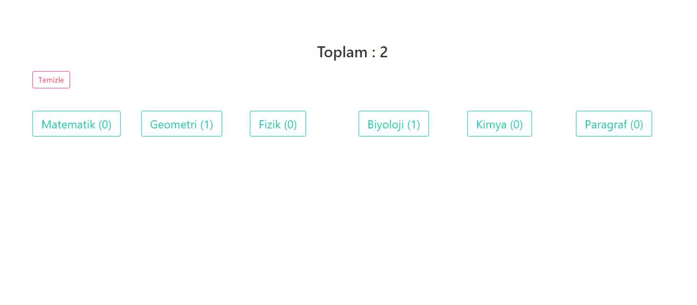

# Proje nedir
Soru sayma projesi




# Nasil Calisitirilir

**Not** projenin calismasi icin node.js v4.x.x ve ya daha yuksek  ve npm 3.x.x. gereklidir

```bash
git clone https://github.com/TheYkk/soru-say
cd soru-say
npm i   
npm start    # uygulamayi baslatir
```

# Klasor Yapisi

```
.
├── CONTRIBUTING.md
├── LICENSE
├── README.md
├── src
│   ├── components
│   │   ├── Say.Vue
│   ├── stylesheets
│   │   ├── app.scss
│   │   ├── variables.scss
│   ├── index.html
│   ├── main.js
├── gulpfile.js
├── webpack.config.js
└── package.json
```

# License

MIT